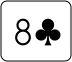

# Using HEH Data

All data held in the Holdem Heroes smart contract is freely available for developers to pull in and use in their own smart contracts and games. In addition to the standard NFT data and ownership, there are two datasets on which NFTs are built, and that are available for anyone to use:

1. Card Data
2. Hand Data

## 1. Card Data

The card dataset holds information on a standard 52 card deck. It is held statically within the contract and is accessible by passing an integer ID from 0 - 51, to represent each card. The data is held such that queries for the same card ID are guaranteed to yield the same result with every request. For example, querying for card ID 24 will always return the data for Eight of Clubs.

Further, each card's component data is available for anyone who requires a more granular breakdown of each card.

Card data is available in multiple formats:

1. Component data (suit and number)
2. String value
3. SVG

### 1.1 Component Data

The `getCardAsComponents` function can be used to obtain a breakdown of the card in its component parts - i.e. its suit and number. The function will return two `uint8` values, which can be used in mathematical computations in a smart contract. The values returned represent an array index for the `numbers` and `suits` public arrays respectively. For example, calling&#x20;

```
getCardAsComponents(24);
```

Will return:

```
[6, 0]
```

These return values may be used as they are, of passed to the respective public `numbers` and `suits` arrays to obtain their string values:

```
numbers(6); // returns "8"
suits(0);   // returns "c"
```

### 1.2 String Value

The `getCardAsString` function will simply return the string name of the passed card ID. This may be useful, for example, for displaying quick data about a card. For example,

```
getCardAsString(24);
```

will return `8c`

### 1.3 SVG

Finally, the `getCardAsSvg` function will return the given card ID as an SVG XML string. For example

```
getCardAsSvg(24);
```

will return

```
<svg xmlns="http://www.w3.org/2000/svg" xmlns:xlink="http://www.w3.org/1999/xlink" viewBox="0 0 72 62" width="2.5in" height="2.147in">
  <symbol id="S0" viewBox="-600 -600 1200 1200">
    <path d="M30 150c5 235 55 250 100 350h-260c45-100 95-115 100-350a10 10 0 0 0-20 0 210 210 0 1 1-74-201 10 10 0 0 0 14-14 230 230 0 1 1 220 0 10 10 0 0 0 14 14 210 210 0 1 1-74 201 10 10 0 0 0-20 0Z" fill="#000"/>
  </symbol>
  <symbol id="F6" viewBox="-600 -600 1200 1200">
    <path d="M-1-50a205 205 0 1 1 2 0h-2a255 255 0 1 0 2 0Z" stroke-width="80" stroke-linecap="square" stroke-miterlimit="1.5" fill="none"/>
  </symbol>
  <rect width="70" height="60" x="1" y="1" rx="6" ry="6" fill="white" stroke="black"/>
  <use xlink:href="#F6" height="32" width="32" x="7" y="16" stroke="#000"/>
  <use xlink:href="#S0" height="32" width="32" x="32" y="16"/>
</svg>
```

which will render as:



## 2. Hand Data

All 1326 starting hands are available to pull into and implement in your smart contracts
